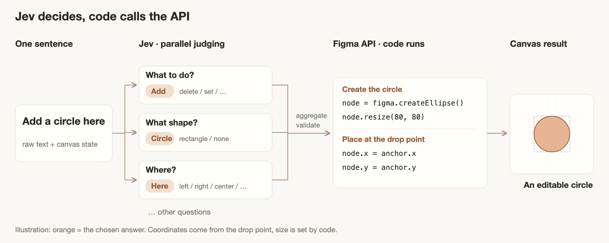

# Jev × Figma: make a model understand design instructions

> [中文](README.md) | **English**

An experiment with **Jev**: you say "add a circle here", Jev decides what the sentence means, and code draws it in Figma.

The question this project is trying to answer: **can a handful of small multiple-choice questions be composed into different design operations?** Figma is the canvas where the result is observed.

## How one sentence becomes an operation



Take "add a circle here". The diagram keeps only three questions: **what to do → add, what shape → circle, where → here**. They are judged in parallel; the other questions are elided.

Code aggregates the answers, validates them, then calls `figma.createEllipse()` to create the node, `node.resize(80, 80)` to make it a circle, and sets `node.x / node.y` to the drop point. **Jev picks answers; code calls the API.** The coordinates for "here" come from the anchor you dragged onto the canvas — the model never guesses them. 80 × 80 is a default in code.

Each node is one question sent to the same Jev model. Jev returns the chosen option, a probability per option, and a confidence score. If it is not confident, code asks again; if it is still unclear, nothing executes. The diagram is an illustration of the flow, not a recorded run.

Say "add a rectangle" instead and the same questions are reused — only the code changes, to `figma.createRectangle()`. That composability is what this project exists to test.

## What is Jev?

[Jev](https://docs.typesafe.ai/model-jaggedness/jev-1.13) is TypeSafe's **System One** model (released September 2026, current version `jev-1.13`). It does not generate text. You send it a state plus a set of typed questions, and it returns one decision per question:

- **Choice** — pick one option from a set you define; returns the pick, a probability per option, and a confidence score.
- **Score** — place the state on an ordered rubric you describe.
- **Noul** — yes/no, as a probability between 0 and 1.

All questions in one request are evaluated in parallel against the same state, so adding questions barely changes latency. There is no chat, no generated code, no explanation.

That shape is the reason this plugin works the way it does: the model is not asked to emit a DSL or a JSON patch. It answers closed questions, and code does the rest.

## Quick start

You need **Node.js 20+**, the **Figma desktop app**, and a **TypeSafe API Key**.

```bash
npm ci
npm run check
npm run build
npm run jev
```

1. In the Figma desktop app, choose **Plugins → Development → Import plugin from manifest…** and pick `manifest.json` in this folder.
2. Open the plugin, click the gear icon, enter your TypeSafe API Key and connect. The local service listens on `http://localhost:8788`.
3. Drag the crosshair button below the text box onto empty canvas in the current page and wait for it to turn green. That drop point is what "here" refers to.
4. Type "add a rectangle here" and press Run, then keep refining it sentence by sentence. For exact sizes include `px`.

Without a drop point the plugin will not create objects; editing existing objects does not need one. Creating a button requires a single usable local button component in the file.

The key is kept only in the local service process memory — never written to the Figma document, plugin storage, or build output. You can also supply it via the `TYPESAFE_API_KEY` environment variable. Restarting the service clears it. After changing plugin code, rebuild and reopen the plugin; after changing server code, restart the service.

> The plugin UI is currently Chinese-only. The instructions it sends to Jev are Chinese too — TypeSafe documents English as Jev's primary language, so English instructions may calibrate better.

## What you can try

| Object or action | Currently implemented |
| --- | --- |
| Circle, rectangle | create, scale as a whole, fill, stroke; rectangles support width/height and corner radius |
| Text | standalone text, text centered inside a shape, the single editable text slot in a component |
| Button component | instantiates an existing component; adjusts semantic type and size by available variants |
| Generic actions | duplicate, move, arrange, delete and undo on supported objects |

One sentence handles at most three related clauses. Duplicate and arrange support up to 20 objects at a time. "Duplicate nine" and "duplicate to nine" mean nine new objects and nine total, respectively.

Not supported: targeting by name, creating arbitrary components, arbitrarily deep hierarchies, gradients / highlights / shadows, and independent color or bold control for text nested in a shape. Circles do not support per-axis size or corner radius. Deleting intrinsic properties such as width and height is rejected, and a button's semantic variant cannot be faked with a plain fill change.

## Current limitations

Text input is the reliable path today. Speech recognition is not done by Jev; when speech is available, each finished short sentence is queued and executed automatically, while interim transcript text is not. The Figma desktop app currently returns `not-allowed`, meaning speech input is refused before Jev is ever reached — the cause still needs investigation on real hardware.

## Development

| File | Responsibility |
| --- | --- |
| `server/questions.mjs`, `server/interpret.mjs` | Jev question definitions, requests, per-clause understanding |
| `server/compose.mjs`, `server/text-content.mjs` | command composition, extracting numbers and text from the original sentence |
| `server/jev.mjs` | local service, key handling, health check |
| `src/ui.ts`, `src/voice-queue.ts` | UI, speech input and the ordered queue |
| `src/live-edit.ts`, `src/object-adapters.ts` | target validation, Figma operations, rollback and undo |
| `src/workflow.ts` | canvas drop point and button component lookup |

Adding a new operation means both teaching Jev to recognise it and writing the validation and execution code. Adding an option alone does not give Figma a new capability.

```bash
npm run check
npm test
npm run build
npm run smoke
```

The checks above pass and are documented: they cover parsing, speech-queue deduplication, the local service, and simulated Figma operations. **That is not the same as real end-to-end verification.** Real Jev requests and real Figma writes have not been signed off yet, and desktop speech has the failure noted above. Chinese free-form phrasing and the confidence thresholds still need calibration against the live API.

References: [TypeSafe API](https://docs.typesafe.ai/api) · [Jev known limitations](https://docs.typesafe.ai/model-jaggedness/jev-1.13) · [Figma plugin docs](https://developers.figma.com/docs/plugins/plugin-quickstart-guide/)

## License

MIT
