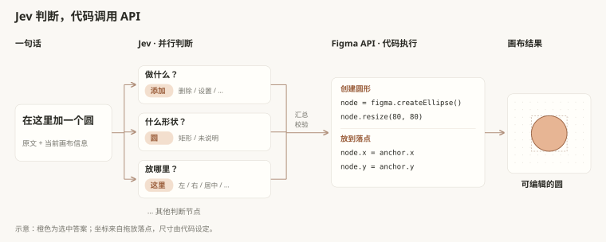

# Jev × Figma：让模型听懂设计指令

> English | [English](README.md) · **中文**

这是一个 **Jev 模型实验项目**：你说“在这里加一个圆”，Jev 判断这句话是什么意思，再由程序在 Figma 里画出来。

我们想试的是：**把一句话拆成几道小选择题，能不能组合出不同的设计操作？** Figma 是观察结果的画布。

## 一句话是怎么变成操作的？



以“在这里加一个圆”为例，图中只保留 3 道小选择题：**做什么 → 添加、什么形状 → 圆、放哪里 → 这里**。它们同时判断，其他节点用“…”省略。

程序汇总答案并检查后，调用 `figma.createEllipse()` 创建图形，用 `node.resize(80, 80)` 设为圆，再把 `node.x / node.y` 设为画布落点。**Jev 选答案，代码调用 API。** “这里”的坐标来自你拖放的定位点，不由模型猜测；80 × 80 是代码里的默认尺寸。

每个节点是交给同一个 Jev 模型的一道题。Jev 返回选项、概率和置信度；不明确时程序会复问，仍不明确就不执行。图中是流程示例，不是实测记录。

换成“加一个矩形”，仍复用这些问题，再由代码选择对应的 `figma.createRectangle()`。这就是本项目要验证的组合方式。

## 快速开始

需要 **Node.js 20+、Figma 桌面版、TypeSafe API Key**。

```bash
npm ci
npm run check
npm run build
npm run jev
```

1. 在 Figma 桌面版选择 **Plugins → Development → Import plugin from manifest…**，导入本目录 `manifest.json`。
2. 打开插件，点击连接设置，输入 TypeSafe API Key 并连接。本机服务地址为 `http://localhost:8788`。
3. 将输入框下方的定位图标拖到当前页面的空白画布，等图标变绿。这个真实落点就是指令中的“这里”。
4. 输入“在这里加一个矩形”，点击“执行”；随后逐句修改。精确尺寸请带上 `px` 或“像素”。

没有明确落点时不能创建对象；修改已有对象无需重新定位。创建按钮需要文件中存在唯一可用的本地按钮组件。

Key 只保存在本机服务进程内存中，不写入 Figma 文档、插件存储或构建产物；也可通过环境变量 `TYPESAFE_API_KEY` 提供。重启服务后需重新配置。更新插件代码后重新构建并重开插件；更新服务代码后重启服务。

## 可以拿它试什么？

| 对象或操作 | 当前实现 |
| --- | --- |
| 圆、矩形 | 创建、整体缩放、填充、描边；矩形支持宽高和圆角 |
| 文字 | 独立文字、图形内居中文字、组件中唯一可编辑的文字位置 |
| 按钮组件 | 使用已有组件实例；按可用变体调整语义类型与尺寸 |
| 通用操作 | 对支持的对象复制、移动、排列、删除和撤销 |

一句话最多处理三个前后有关联的分句；复制／排列一次最多支持 20 个对象。“复制九份”与“复制成九份”分别表示新增数量和最终总数。

暂不支持按名称定位、通用组件创建、任意复杂层级、渐变／高光／阴影，以及图形内关联文字的独立颜色和粗体调整。圆不支持单轴宽高和圆角。删除宽高等固有属性会被拒绝；按钮的语义变体也不能用普通改色冒充。

## 目前有哪些限制？

先用文字输入体验。语音识别不由 Jev 完成；语音可用时，每说完一个短句就会自动排队执行，未说完的临时文字不会执行。目前 Figma 桌面版已出现 `not-allowed`，即语音输入被拒绝，还没到 Jev 这一步，原因待实机排查。

## 开发与验证

| 文件 | 职责 |
| --- | --- |
| `server/questions.mjs`、`server/interpret.mjs` | Jev 问题定义、请求与分句理解 |
| `server/compose.mjs`、`server/text-content.mjs` | 命令合成、原文数字与文字提取 |
| `server/jev.mjs` | 本机服务、Key 配置与健康检查 |
| `src/ui.ts`、`src/voice-queue.ts` | 界面、语音输入与顺序队列 |
| `src/live-edit.ts`、`src/object-adapters.ts` | 目标校验、Figma 操作、回滚与撤销 |
| `src/workflow.ts` | 画布落点与按钮组件查找 |

想增加一种操作，需要让 Jev 能识别它，也要给程序补上检查和执行代码。只加一个选项，Figma 不会自动获得新能力。

```bash
npm run check
npm test
npm run build
npm run smoke
```

已有文档记录以上检查通过，覆盖解析、语音队列去重、本机服务及模拟 Figma 操作；这不等于真实端到端通过。**真实 Jev 请求和真实 Figma 写入尚未记录验收通过，桌面版语音已有上述失败反馈。** 中文自由表达和置信度仍需真实 API 校准。

参考：[TypeSafe API](https://docs.typesafe.ai/api) · [Jev 已知限制](https://docs.typesafe.ai/model-jaggedness/jev-1.13) · [Figma 插件开发](https://developers.figma.com/docs/plugins/plugin-quickstart-guide/)
